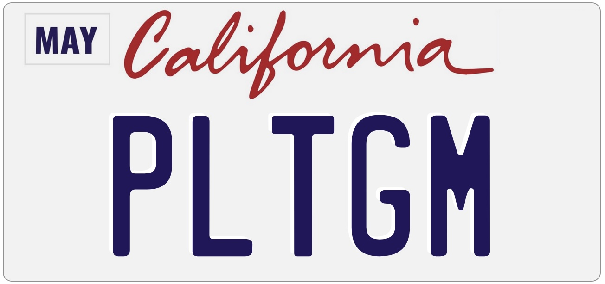

# PLTGM: The License Plate Game

You're stuck in traffic for three hours because the potato truck down the highway flipped over. All you can see is the rear of the 2014 Hyndai Elantra in front of you. What are you going to do with your time?

## How To Play

Click 'New Game'. You will be given a license plate from an American state. Simply provide all the English words you can think of that use **all** the plate's letters **in order**. Proper nouns are not allowed.

### Example

Given the Washington license plate `TEN8646`:

| Valid Words ✅          | Invalid Words ❌                           |
| ----------------------- | ------------------------------------------ |
| **ten**                 | net [letters not in order]                 |
| **ten**t                | new [does not use all letters]             |
| bea**ten**              | en [*definitely* does not use all letters] |
| effec**t**iv**en**ess   | benu**t**z**en** [not an English word]     |
| effec**t**iv**en**esses | dé**ten**te [rewrite as *detente*]         |
|                         | **Ten**cent [proper noun]                  |

## Technical

This app uses a Vue frontend, a Node web server, and a sqlite3 store for dictionary referencing and game data.

Contributions are welcome! File a ticket if one doesn't exist already and get going on a PR.

### Prerequisites

- A line delimited word list named `english-words.txt` must be present in `server/assets`. Don't ask for the one used on production.

### Setup (Docker)

1. In the repo root directory, run `docker compose up`.

### Setup (Dockerless)

1. Install Bun and Node 24.
1. Server: navigate to `/server` and run `npm i`.
1. Client
   1. Navigate to `/client` and run `bun i`.
   1. Assets not part of this repo will have to be added manually. See `client/assets/LICENSES.md`.
   1. Run `bun run dev`.
1. Navigate to http://localhost:5174.
